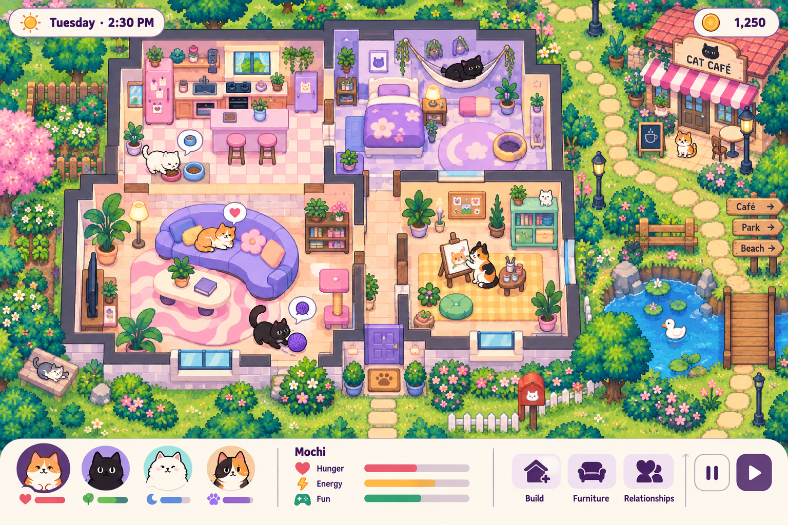

# Cats — product specification

## Problem Statement

Cats is a private browser gift for a cat-loving player who wants the emotional comedy and autonomy of a life simulator, with the warmth of a cat game. The product must let her direct a household while its cats make meaningful choices, build a home, care for one another, form relationships, earn and spend money, and experience permanent consequences. It must feel equally complete on a phone and computer, continue the same household across those devices, and stop time when closed.

This specification separates the founder-confirmed contract (R01–R25) from concrete proposed engineering and balancing defaults. A proposed default makes implementation possible; it is not an additional founder approval.

## Solution

A single-neighborhood browser simulation presents an overhead cutaway home and a lively explorable neighborhood. The player manages a household of up to eight living cats, mixing direct suggestions with autonomous behavior. A deterministic simulation advances only while the game is open, with care, mood, relationships, careers, hobbies, café business play, construction, decorating, goals, unlocks, memorials, and ghosts forming one connected loop. The same private account and household snapshot can be resumed on phone or computer.

### Confirmed scope contract

1. **R01 — Browser cat household simulation.** Direct a household of cats with personalities and free will.
2. **R02 — All play pillars.** Personalities/drama, building/decorating, and care/goals/progression are all core.
3. **R03 — Cat antics and whimsical lives.** Real feline behavior sits alongside hobbies, adventures, goals, careers, and romance.
4. **R04 — Phone and computer parity.** Phone and computer are equally important; core actions work on both.
5. **R05 — Approved art.** Use the approved A+B direction: pastel cartoon cats and furnishings, overhead cutaway home, and pixel-detailed neighborhood.
6. **R06 — Full house building.** Build rooms, walls, doors, and decorate with furniture, colors, and cat furnishings.
7. **R07 — Real and fictional cats.** Recreate real cats and create or adopt fictional cats with names, looks, and personalities.
8. **R08 — Death and permanent loss.** Death and permanent loss are explicitly in scope.
9. **R09 — Pause when closed.** No simulation time, aging, needs decay, or death while closed.
10. **R10 — Automatic synced saves.** Continue the same household automatically between computer and phone.
11. **R11 — Private gift.** Access is for her, her daughter and testing; public source does not authorize public gameplay registration.
12. **R12 — Money and unlocks.** Earn game money and unlock content in normal play.
13. **R13 — Optional free-build.** Offer free-build alongside earned progression.
14. **R14 — Careers.** Scheduled careers with skills and promotions. Cats wear clothes relating to their careers when they go off to work.
15. **R15 — Hobbies and businesses.** Hobbies and little businesses are income sources.
16. **R16 — Moo-Moo terminology.** The action is called exactly “Moo-Moo.”
17. **R17 — Mutual readiness.** Cats must be in love, aligned, and in the mood; player input cannot override the partner.
18. **R18 — Autonomous and directed.** Moo-Moo may be initiated by a cat or suggested by the player.
19. **R19 — Chance of kittens.** Moo-Moo has a chance, not a guarantee, of kittens.
20. **R20 — Eight-cat capacity.** Maximum eight living household cats, including kittens.
21. **R21 — Moo-Moo at capacity.** At eight cats Moo-Moo remains available but cannot initiate a new pregnancy.
22. **R22 — Memorial and ghosts.** Death creates a memorial and occasional ghost visits never resurrect a cat.
23. **R23 — Fixed lifespan.** Pace is between normal and slow; no lifespan setting.
24. **R24 — One neighborhood.** One lively playable neighborhood has homes, café, park, shops, and other cats.
25. **R25 — Included picture.** This exact approved image is included in the handoff and repository.
26. **R26 — Private family co-op.** She and her daughter can play together simultaneously from their own devices in one shared household with up to four cats per player (eight household total). Preserve private family access, mutual presence, cooperative pause, all existing gameplay and no unattended offline progression.
27. **R27 — Kitten genetics and inheritance.** Percentage-based inheritance of looks and personality traits from both parents (working default 45% dam / 45% sire / 10% novel domestic mutation; configurable 50/50 strict parental). Exact same-parent aggregation, immutable conception snapshots, two distinct traits via dynamic weight redistribution, deterministic PRNG sequence, strict non-inheritance of outfits/skills/moods/money, 4-cat-per-player capacity reservations, and lineage gating preventing novel rolls from handing out undiscovered fantasy/wild cats.
28. **R28 — Complete reusable GPT Image artwork.** All in-game visual assets (rooms, furnishings, lots, cat sprites and portraits, career uniforms, tools, crops, recipes, neighborhood tiles, and UI icons) derive from reusable GPT Image originals matching the approved pastel cartoon and pixel neighborhood direction, replacing placeholder emoji/blocks while keeping geometry, collision, and text rendering in code.
29. **R29 — Broad cat collection and rare exploration discovery.** Comprehensive cat collection encompassing domestic breeds (grounded in official TICA/CFA standards), mixed coats, rare wild cats, and mythical fantasy cats. Wild and fantasy cats are the rarest tiers, discovered and befriended through exploration, never starter-created. Durable discovery, no reload/device-swap rerolls, full-household befriending without forced eviction, and no paid random draws.
30. **R30 — Feline-adapted human-like activities and authentic behaviors.** Cats perform human-like career and hobby activities adapted authentically to feline anatomy and paws (kneading dough, digging gardens, dabbing paint, carrying baskets, tailored 4-legged career outfits without human torsos or hands), interspersed with authentic feline instincts (loafing, box napping, grooming, head-bunting, tail language, and zoomies).
31. **R31 — Durable lineage and hybrid breed naming.** Multi-generation lineage graph tracking ancestors across living, adopted, and memorialized cats with DAG acyclicity validation and inbreeding prevention guards (up to 3 generations). Order-independent, deterministic coined hybrid breed naming at birth when parents are of distinct breeds (e.g. Bengal x Ragdoll -> Ragdal), preserving foundation breeds and generation depth (F1, F2). Interactive family tree visualization on desktop and mobile synchronized across co-op sessions.
32. **R32 — Expanded functional customization and furniture.** Comprehensive home and cat customization expanding functional catalog to at least 64 usable items across 4 cohesive styles (Cozy Cottage, Modern Cat, Whimsical Play, Rustic Garden). Explicit feline need affordances (climbing, scratching, hydration, comfort), reversible wall/floor swatches, expanded coat/eye palettes and accessories, and modular GPT Image rendering with mobile drag/rotate controls.

### User Stories

1. As a player, I want to start a private household and inspect each cat's identity and state, so that I understand the household immediately.
2. As a player, I want to recreate real cats or create fictional cats, so that the household feels personal.
3. As a player, I want to suggest actions while cats retain autonomy, so that direction and free will coexist.
4. As a player, I want pause and resume controls without a speed setting, so that I control attention without changing fixed aging.
5. As a player, I want needs, motives, and warnings to be visible, so that I can intervene before preventable harm.
6. As a player, I want care responses to illness, accidents, neglect, and aging warnings, so that choices have meaningful consequences.
7. As a player, I want antics, friendships, conflict, romance, hobbies, adventures, and goals, so that each cat develops a changing story.
8. As a player, I want to suggest Moo-Moo or observe cats initiating it, so that romance can be directed or autonomous.
9. As a player, I want refusals to consume no pregnancy roll, so that mutual readiness is real.
10. As a player, I want pregnancy and litter capacity shown, so that births never silently overflow the household.
11. As a player, I want fixed life stages and remaining stage information, so that aging is legible without a lifespan setting.
12. As a player, I want permanent death with actionable warnings where possible, so that consequences remain meaningful and fair.
13. As a player, I want memorials and non-resurrecting ghost visits, so that loss can be remembered without reversal.
14. As a player, I want to adopt a newcomer into a preserved empty household after its last cat dies, so that the household save remains recoverable without resurrecting anyone.
15. As a player, I want rooms, walls, doors, furniture, colors, and cat furnishings, so that I can build a complete home.
16. As a player, I want free-build edits to retain provenance and normal consequences, so that creative play cannot mint progression.
17. As a player, I want careers, skills, promotions, hobbies, and café income, so that several play styles support the household.
18. As a player, I want unlock reasons and prices, so that progression is understandable.
19. As a player, I want playable homes, café, park, shops, and neighborhood cats, so that the neighborhood is more than scenery.
20. As a player, I want the same household on phone and computer, so that saves follow me.
21. As a player, I want interrupted local recovery after network failure, so that a conflict does not destroy progress.
22. As a player, I want plain-language errors and safe retries, so that stale saves and failed actions are recoverable.
23. As a tester, I want isolated deterministic fixtures, so that simulation, persistence, death, pregnancy, and responsive cases reproduce safely.
24. As a private recipient, I want allowlisted access while source remains reviewable, so that the gift stays private.
25. As a player, I want every core action to work with touch and pointer/keyboard affordances, so that neither device is second-class.
26. As a player, I want to name my household, so that its identity survives reloads and sign-in changes.
27. As a player, I want to select a cat from a household portrait, so that I can inspect and direct the intended cat.
28. As a player, I want to move a cat around furniture with reachable paths, so that movement feels physical and understandable.
29. As a player, I want to pan and zoom the home on touch and pointer input, so that the whole lot remains usable on small screens.
30. As a player, I want to cancel a movement or pointer gesture, so that an accidental command does not trap a cat.
31. As a player, I want renderer recovery after a lost canvas, so that a temporary graphics failure does not lose my household.
32. As a player, I want autosave status to say Saving, Saved, or Reconnecting, so that I know whether my progress is safe.
33. As a player, I want a second device to resume the latest confirmed revision, so that switching devices does not duplicate time.
34. As a player, I want a stale device to explain a revision conflict, so that I can recover rather than overwrite newer progress.
35. As a player, I want a lease takeover to be explicit, so that I understand why another device can no longer write.
36. As a player, I want a closed or hidden game to pause immediately, so that no unobserved needs decay occurs.
37. As a player, I want network loss to pause and checkpoint safely, so that offline time cannot cause death or action progression.
38. As a player, I want to build walls and doors on a grid, so that I can make a genuinely different floor plan.
39. As a player, I want furniture placement to show collision and reachability, so that I do not create an unusable room.
40. As a player, I want to recolor rooms and furnishings, so that the home reflects the household personality.
41. As a player, I want free-build edits to retain provenance, so that experimentation cannot mint money or resale value.
42. As a player, I want earned mode to preserve careers and money, so that creative building does not remove the life simulation.
43. As a player, I want career schedules and shifts to be visible, so that I can plan care around work.
44. As a player, I want promotions to require skills and goals, so that career progress feels earned.

Career outfit requirement (added by the founder on 2026-09-20): every career has recognizable work clothes that the cat automatically wears at departure and while working. Engineering default: Café Assistant apron, Garden Keeper overalls/sunhat, Gallery Helper smock/beret. Return, canceled shift, job change and interrupted work restore the ordinary look; never overwrite the cat's coat or ordinary accessories. Outfit state derives from real saved career activity, survives reload and device resume, and appears in world sprites and portraits on phone and desktop.
45. As a player, I want painting and gardening to produce distinct outputs, so that hobbies are meaningful rather than decorative.
46. As a player, I want to grow tomatoes, strawberries, and catnip, so that gardening has a concrete progression.
47. As a player, I want to own and operate the café, so that a small business is a playable income source.
48. As a player, I want café recipes and supplies to matter, so that business choices affect earnings.
49. As a player, I want unlock conditions and prices explained, so that progression never feels arbitrary.
50. As a player, I want to visit the player home and three NPC homes, so that neighborhood relationships have places to develop.
51. As a player, I want to visit the park and shop, so that errands and social opportunities are playable.
52. As a player, I want eight named neighborhood cats with routines, so that the neighborhood feels populated without expanding household capacity.
53. As a player, I want eighteen goals across care, relationships, building, work, hobbies, business, neighborhood, and legacy, so that every pillar has direction.
54. As a player, I want a pregnancy record with due date and reserved slots, so that I understand exactly why a litter can or cannot arrive.
55. As a player, I want a declined Moo-Moo proposal to consume no random roll, so that refusal never secretly changes pregnancy odds.
56. As a player, I want cats to initiate Moo-Moo autonomously when eligible, so that free will affects romance.
57. As a player, I want a player suggestion unable to override a partner's refusal, so that mutual readiness has meaning.
58. As a player, I want seven living cats to allow only one reserved litter slot, so that birth cannot overflow the household.
59. As a player, I want eight living cats to allow romance but no pregnancy, so that capacity is clear without removing the action.
60. As a player, I want pregnancy to produce one to three kittens only at birth, so that reserved capacity remains consistent.
61. As a player, I want kitten, adolescent, adult, and elder transitions to be visible, so that fixed aging is legible.
62. As a player, I want illness and accident warnings before preventable death, so that care and intervention can matter.
63. As a player, I want sudden causes to be explained as sudden, so that warnings do not make every event falsely predictable.
64. As a player, I want a deceased cat's memorial to preserve its identity, so that permanent loss still has remembrance.
65. As a player, I want ghost visits to be occasional projections, so that they add emotion without resurrecting a cat.
66. As a player, I want an empty household to preserve its lot and inventory, so that last-cat death does not corrupt the save.
67. As a player, I want to adopt a newcomer into an empty household, so that recovery adds a new living cat instead of resurrecting anyone.
68. As a tester, I want seeded fixtures for simulation branches, so that failures can be reproduced exactly.
69. As a tester, I want owner-isolation fixtures, so that security tests never touch production identities.
70. As a tester, I want phone and desktop browser scenarios, so that responsive parity is verified through real controls.
71. As a tester, I want visual review against the approved direction, so that generative reference art guides the look without becoming a fake gameplay screen.
72. As a private recipient, I want allowlisted access with public source visibility, so that the gift remains private while its plan can be reviewed.
73. As a household owner, I want to create a private single-use family invite link, so that I can invite my daughter to play together without external messaging services.
74. As an invited family member, I want to join my family's household by redeeming an invite link with only a display name and theme color, so that I can play immediately without disclosing my age, date of birth, or personal contact information.
75. As a family player, I want distinct pastel selection reticles over our selected cats, so that both of us can see each other's focus without visual confusion.
76. As a family player, I want either of us to pause the game instantly with a clear indicator of who paused, so that real-life interruptions can be handled immediately and safely.
77. As a family player, I want zero needs decay, aging, or simulation advance while paused or while both of us are away, so that unattended cats never suffer or miss life events.
78. As a family player, I want concurrent cat care, building, and shopping actions to resolve authoritatively on the server, so that conflicting commands never corrupt household state or produce negative money balances.
79. As a family player, I want concurrent Moo-Moo interactions to strictly enforce the eight-cat capacity limit, so that simultaneous romantic successes can never overflow the household.
80. As a family player, I want shared household goals to advance from our collective actions, so that unlocks and rewards benefit our home together.
81. As a family player, I want simulation host authority to fail over smoothly if one device drops or closes, so that the surviving device continues playing without losing progress.
82. As a family player, I want a reconnecting device to catch up to the current household state quickly, so that temporary network loss does not desynchronize our play.
83. As a player, I want kittens to inherit looks and personality traits from both parents based on explicit percentage chances, so that offspring reflect their family lineage.
84. As a family player, I want each of us to have a hard limit of four living or reserved cats, so that our shared home never exceeds eight cats and both of us have guaranteed pet slots.
85. As a player, I want kitten genetic provenance and immutable base appearances preserved, so that career uniforms and accessories never alter a cat's hereditary lineage.
86. As a player, I want all rooms, furnishings, cats, and neighborhood scenes rendered from coherent GPT Image artwork, so that the game matches the approved pastel cartoon and pixel neighborhood direction without emoji or placeholder blocks.
87. As a player, I want four-legged tailored workwear rendered on cat sprites when they leave for career shifts, so that their jobs are visibly recognizable without human torsos or hands.
88. As a player, I want to explore the neighborhood to discover and befriend rare wild and mythical fantasy cats, so that rare additions to my household feel earned and exciting.
89. As a player, I want a Cat Dex collection log that tracks discovered breeds and encounter lore, so that I can celebrate my exploration progress without pay-to-draw mechanics.
90. As a player, I want to befriend rare cats even when our household is full, so that visiting friends remain in our neighborhood without forcing us to evict existing pets.
91. As a player, I want to watch cats perform career and hobby tasks using authentic feline paw motions and jaw carrying, so that human-like activities feel delightfully cat-like.
92. As a player, I want cats to spontaneously loaf, nap in boxes, groom, and get distracted by toys, so that natural feline instincts and personality shine through.
93. As a player, I want a persistent multi-generation family tree, so that my cats' ancestry and lineage history are preserved even after cats pass away.
94. As a player, I want inbreeding and close-relative romance prevented with gentle in-game feedback, so that family relationships remain ethical and wholesome.
95. As a player, I want cross-breed kittens to receive cute, deterministic hybrid breed names at birth, so that unique family mixtures are celebrated without unbounded name sprawl.
96. As a family co-op player, I want to inspect our shared family tree simultaneously from both devices, so that we can celebrate our cats' generations together.
97. As a player, I want hybrid breed recipes to be order-independent, so that pairing dam and sire in either order produces the identical hybrid breed designation.
98. As a player, I want an expanded catalog of at least 64 furnishings across four room styles, so that I can decorate diverse rooms that match my cats' personalities.
99. As a player, I want scratching posts, cat trees, and heated beds to satisfy specific cat needs, so that furniture choices directly enrich my cats' daily well-being.
100. As a player, I want scratch posts to satisfy my cats' claw-maintenance instincts, so that my sofas and walls remain undamaged.
101. As a player, I want reversible wallpaper and floor swatches with instant preview, so that I can experiment with room palettes before committing money.
102. As a player, I want mobile drag and rotate placement gestures with clear touch controls, so that decorating on a phone feels just as fluid as on desktop.

### Proposed balancing defaults

The following are proposed engineering/design defaults for a first playable balance pass, not additional confirmed requirements: one sim day is 24 real minutes at one real second per sim minute; life stages last kitten 10 sim days, adolescent 20, adult 95, and elder 25 (150 total), fixed and not adjustable. Needs use 0–100 values: hunger, hygiene, energy, comfort, social, fun, and health decay at proposed per-minute rates of 0.08, 0.04, 0.06, 0.03, 0.02, 0.02, and 0.01. Mood bands are 0–19 miserable, 20–39 low, 40–69 okay, 70–89 happy, 90–100 ecstatic. Love requires relationship score >=70 and a mutual love flag; in-the-mood requires mood >=60, energy >=35, social >=35, and no illness, work, pregnancy, or refusal. Warnings fire at health <=35, any need <=20, and projected lethal health <=15 minutes. Moo-Moo requires adult, mutual love, willingness, alignment, and mood; its first roll is 25% after completion. Conception reserves slots immediately and produces one to three kittens at birth, capped by available slots; pregnancy lasts three sim days. At eight living cats, Moo-Moo remains romantic but cannot conceive. Zero living cats preserves the household and pauses until adoption. These values must be playtested and may be tuned without changing R16–R23.

## Implementation Decisions

These are proposed architecture defaults for the future executor. They are contracts to implement, not claims that code already exists.

- Use TypeScript with Next.js App Router for the browser shell and route/API boundary; use PixiJS 8 for the world renderer and React DOM for HUD, menus, accessibility, and responsive controls.
- Keep the simulation headless and deterministic behind a command boundary: `loadSnapshot + command + seed + elapsedOpenTime -> events + nextSnapshot + renderProjection`. The renderer never mutates domain state directly.
- Use a seeded, versioned RNG stream. Every random draw has an event label and sequence index; rejected actions, including a declined proposal, consume no roll.
- Represent living cats and deceased cats separately. Deceased records remain in the memorial archive; ghosts reference them and cannot satisfy household capacity or resurrection paths.
- Reserve unborn litter slots at conception. Pregnancy creation is transactional and cannot exceed eight living plus reserved offspring capacity; no adoption, birth, or move silently discards a cat.
- Use fixed sim time while a tab is active. Closing, backgrounding beyond the chosen visibility policy, or losing network does not create offline progression; the client checkpoints locally and syncs when available.
- Proposed persistence is IndexedDB checkpoints plus cloud snapshots and revisions. Proposed managed services are Neon Postgres and Clerk via the Vercel Marketplace; future executor must verify current official APIs before implementation. No runtime AI service or API key is required for play.
- Proposed auth is a private allowlist. Every read and write derives owner identity server-side; client-provided owner IDs are untrusted. Public repository visibility does not imply public gameplay registration.
- Use a single-writer lease with server fencing tokens and compare-and-swap revision writes for single-player play, extended in co-op by dynamic host simulation leasing (`sim_leases`) and PostgreSQL command sequencing (`coop_commands`).
- Preserve the unique constraint on `households.owner_id` to protect Task 01 creation concurrency safety. Multi-member family co-op is authorized via `household_members` with roles `owner` and `family_member`.
- Co-op real-time transport uses Server-Sent Events (`text/event-stream`) downstream, implemented via a durable PostgreSQL polling loop on ephemeral serverless containers (`SELECT ... FROM coop_commands WHERE cmd_seq > $lastSeen` every 250–500ms) rather than in-memory broadcast. Durable command receipts (`command_receipts`) track per-actor monotonic sequence numbers (`actor_seq`) for idempotent dispatch, while ephemeral `coop_commands` event rows are pruned after 15 minutes once committed to durable household snapshots. Server-side command reduction executes inside PostgreSQL transactions (`SELECT ... FOR UPDATE`), committing snapshots before SSE emission.
- Authority lease has a 10-second TTL with 3-second heartbeats. Graceful handoff transfers in < 1 second; abrupt drop failover wait is 10–12 seconds, showing an honest reconnecting status pill and resuming simulation without data loss.
- Zero unattended offline progression: when both players disconnect or background their tabs, simulation advances 0 sim minutes; recovery loads the exact last committed state revision without wall-clock catch-up (R09).
- Co-op conflict resolution enforces atomic CAS on furniture grid cells, atomic server wallet balances, and strict clamping of the 8-cat limit under concurrent Moo-Moo. Caretaker slot profiles (Profile Alpha / Profile Beta, 4 cats max per player) preserve cat custody when members are revoked, defaulting to remaining active owner with explicit `REASSIGN_CAT_CUSTODY` transfers. A 21-route Actor Permission Matrix strictly enforces role authorization across single-player and co-op contexts. All 18 goals evaluate shared canonical domain events.
- Private family invites use 256-bit cryptographically secure tokens hashed at rest (`token_hash = sha256(token)`), single-use, 72-hour TTL. Zero child PII (no DOB, age, email, or real name) is collected. Rejoin uses authenticated session cookies without re-pasting tokens.
- Confirmed family model: shared household on separate simultaneous devices, four cats per player (eight total living/reserved). Working defaults: shared cat care; 45% Dam / 45% Sire / 10% Novel domestic mutation genetics odds (`FAMILY-GENETICS-DECISIONS-02.md`).
- Percentage-based kitten genetics evaluates appearance features and personality traits from immutable conception snapshots; same-parent identical features aggregate probabilities (e.g. 90% observable chance under 45/45/10); kittens strictly possess exactly two distinct personality traits (`traits: [PersonalityTrait, PersonalityTrait]` where `traits[0] !== traits[1]`). Pre-conception validation enforces $|P_A \cup P_B| \ge 2$, with zero-division guards in dynamic weight redistribution (Trait 2 candidate weight sum guaranteed $> 0$ via novel domestic fallback under 45/45/10 and actionable rejection `CANNOT_CONCEIVE_INSUFFICIENT_PARENT_TRAITS` under 50/50 strict mode); 10% novel mutations draw exclusively from common domestic catalog to prevent handing out undiscovered rare wild/fantasy cats; starter cats migrate deterministically with null provenance.
- Complete visual asset integration uses reusable GPT Image originals matching the approved pastel cartoon and pixel neighborhood direction (docs/art/approved-direction.png), replacing procedural placeholders across cutaway rooms, furnishings, lots, cat sprites/portraits, and four-legged tailored career uniforms while preserving layout, collision, and text rendering in code.
- Comprehensive cat catalog grounds domestic breeds in official TICA/CFA standards, offering mixed coats, rare wild cats, and mythical fantasy cats; wild and fantasy cats are locked behind exploration and befriending in the neighborhood and cannot be spawned in the starter creator; exploration encounter scheduler is governed by active simulation time (1 real second = 1 sim minute; 60 sim minutes active window; 0 delta when paused/offline), persisting encounters in `world.neighborhood.activeEncounters` to prevent reload reroll exploits, with concrete category weights: 70% Common Domestic, 24% Uncommon Domestic, 5% Rare Domestic, 0.75% Rare Wild across 8 species, and 0.25% Mythical Fantasy across 8 forms; Cat Dex persists discovery and friendship without reload reroll exploits or paid random draws.
- Feline-adapted activities adapt human-like careers and hobbies to four-legged feline bodies and paws (kneading dough, digging gardens, dabbing paint, carrying baskets) with tailored outfits, accompanied by natural cat instincts (loafing, box napping, head-bunting, grooming, tail flicks, zoomies).
- Durable multi-generation lineage records ancestry in `WorldState.lineage` using immutable node structures (`LineageNode`) that persist deceased and memorialized cats indefinitely without erasure. Relatedness checks (`areCatsRelated(catA, catB, maxGenerations = 3)`) reject inbreeding and Moo-Moo romance across parent-child, full/half siblings, and grandparent-grandchild. Deterministic order-independent hybrid breed naming computes recipe key `sort([breedA, breedB]).join('x')` to coin hybrid breed names at birth (e.g. Bengal x Ragdoll -> Ragdal), preserving foundation breeds and generation depth (F1, F2).
- Expanded content catalog provides at least 64 usable items across 4 room styles (Cozy Cottage, Modern Cat, Whimsical Play, Rustic Garden) with explicit need affordances (Fun from climbing shelves, Scratch need and sofa durability protection from sisal lounges, Hydration from automatic fountains, Comfort/Energy recovery from heated beds), reversible swatches, expanded cat palettes/accessories, and modular GPT Image rendering.
- Proposed complete initial content is: careers Café Assistant, Garden Keeper, and Gallery Helper (three ranks each); hobbies Painting and Gardening; crops tomato, strawberry, and catnip; an ownable café with recipes fish pie, cream bun, and catnip tea; eight named NPC cats; seven lots (player home, three NPC homes, park, shop, café); 64+ functional furniture/decor IDs across seating, sleep, care, play, skill, storage, construction, and décor; starter creator inventory; and 18 named goals spanning care, relationships, building, careers, hobbies, business, neighborhood, and legacy. These are complete first-pass defaults, subject to balancing.
- A free-build session is explicitly marked with provenance (`normal`, `free-build-preview`, or `free-build-committed`); it cannot mint money, unlocks, births, or resale value. Normal saves retain consequence rules.

## Testing Decisions

- Domain unit tests cover needs, autonomy arbitration, relationships, Moo-Moo readiness, no-roll declines, conception probability with fixed seeds, litter slot capacity, pregnancy, life-stage transitions, warnings, death, memorials, ghosts, last-cat recovery, economy, unlocks, free-build provenance, and command idempotency.
- Persistence contract tests cover owner isolation, authentication failure, revision conflicts, CAS retries, duplicate command IDs, lease expiry, fencing rejection, takeover, payload limits, malformed snapshots, schema upgrades, corruption quarantine, and no offline progression.
- Co-op contract tests cover multi-actor authorization, invite token hashing and single-use redemption, member revocation, command sequence monotonicity, concurrent wallet/grid cell conflicts, 8-cat capacity clamping under dual Moo-Moo, dynamic lease failover (10–12s), and SSE reconnection replay via `Last-Event-ID`.
- Genetics contract tests cover deterministic PRNG allocation sequence, same-parent feature aggregation (90% observable under 45/45/10), non-colliding trait selection via dynamic weight redistribution, conception snapshots, carrier death abort, and 4-slot-per-player capacity clamping.
- Content and asset tests cover GPT Image sprite sheet loading, layered sprite assembly, 60fps rendering without layout shift, Cat Dex persistence without reload exploits, and feline-adapted animation state synchronization.
- Lineage and furniture tests cover DAG acyclicity, genealogical relatedness traversal (parent-child, sibling, grandparent-grandchild inbreeding prevention), order-independent hybrid name generation at birth, 64+ furniture catalog affordances and need satisfaction, and mobile touch placement drag/rotate.
- Browser seam tests cover the highest-risk flows: first load, touch building placement, keyboard/pointer parity, responsive HUD, autosave/reconnect, two-device stale revision, death warning/intervention, and the full Moo-Moo capacity branch. Use deterministic fixtures and security identities that are never production accounts.
- Dual-context browser tests verify simultaneous mother-daughter play: Desktop pointer (1280x800) and Mobile touch (390x844) executing concurrent care, building, instant cooperative pause, and graceful/ungraceful failover.
- Visual acceptance is human-reviewed against the approved direction and generated reference. Exact pixel equality against generative art is not a valid acceptance criterion. Test layout, readable controls, no horizontal overflow, and phone/computer capability parity.
- Release gates require domain tests, persistence tests, browser seam tests, accessibility checks, production-like migration rehearsal, security fixture tests, and a private allowlist smoke test. Test data and credentials never touch production.

## Out of Scope

Multiple neighborhoods; public registration, stranger discovery, or public multiplayer; offline time catch-up; resurrecting a deceased cat; adjustable lifespan settings; exceeding eight living cats; a hidden pregnancy roll after a declined Moo-Moo; selling free-build-created value for profit; runtime AI dependency or API-key requirement; replacing the approved art direction with a static screenshot; unverified vendor API assumptions; child personal data collection (DOB, age, school, phone, email); open unmoderated chat; implementation in this planning handoff.

## Further Notes

Official references for the future executor to verify before coding: [PixiJS application guide](https://pixijs.com/8.x/guides/basics/application), [Next.js App Router documentation](https://nextjs.org/docs/app), [Neon documentation](https://neon.tech/docs), [Clerk Next.js documentation](https://clerk.com/docs/nextjs/overview), [Vercel Functions WebSockets](https://vercel.com/docs/functions/websockets), [Vercel Guide on WebSockets](https://vercel.com/kb/guide/do-vercel-serverless-functions-support-websocket-connections), and [Vercel Function Duration](https://vercel.com/docs/functions/configuring-functions/duration). Primary breed reference: [TICA All Breeds](https://tica.org/ticas-breeds/browse-all-breeds/) and [CFA Breeds](https://cfa.org/breeds/). The game is private gift software even if its source repository and issue tracker are public. Any later requirement must preserve R01–R32 unless explicitly superseded in a new decision record.
