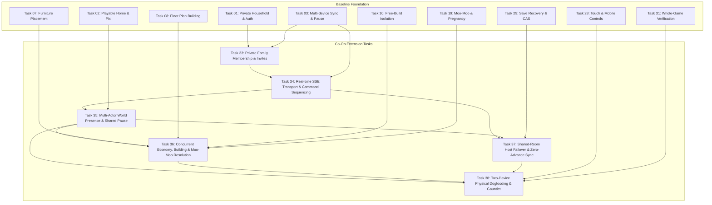

# Private Family Co-Op: Decision, Capability & Dependency Matrix

## 1. Architectural & Product Decision Matrix

| Dimension | Single-Player Baseline (Tasks 01–32) | Default Co-Op Extension (Tasks 33–38) | Alternative: Shared Town / Separate Homes | Alternative: Shared Single Screen Only | Status / Rationale |
|---|---|---|---|---|---|
| **Household & World Model** | 1 household per user account. 1 home lot, up to 8 living cats. | **Shared Household**: Mother & daughter manage the *same* household, cats, economy, and cottage simultaneously. | **Separate Homes in Shared Town**: Mother and daughter each own a cottage on adjacent lots in the same neighborhood. | **Single Screen Shared**: Same household on 1 device with pass-and-play or hotseat cat switching. | **CONFIRMED BY USER**: Same shared household confirmed (`FAMILY-GENETICS-DECISIONS-02.md`). Up to 4 cats per player, 8 total in household. |
| **Device & Client Model** | 1 active device at a time. Exclusive 30s lease (`leases` table). 2nd device rejected or takes over. | **Simultaneous 2 Devices**: Mother on laptop/desktop, daughter on tablet/phone, each with independent viewport and input. | Simultaneous 2 devices; independent camera and lots; mutual neighborhood visits. | 1 active screen; 2 cat focus panels or shared pointer controls. | **CONFIRMED BY USER**: Simultaneous two-device play confirmed (`FAMILY-GENETICS-DECISIONS-02.md`). Local single-device mode preserved as fallback. |
| **Authentication & Membership** | Single owner (`households.owner_id`). 1:1 owner-to-household unique index. | **Multi-Member Private Household**: Preserves `households.owner_id UNIQUE` index; adds `household_members` for Owner (Mom) + Family Member (Daughter). | Multi-member Town/Neighborhood allowlist; separate household per owner. | Single account sign-in; local profile indicator. | Preserves Task 01 owner-create concurrency safety while enabling authorized multi-actor access. |
| **Simulation Authority** | Client single-writer executes simulation; periodically saves cloud snapshot via CAS. | **Dynamic Host Lease + Postgres Command Relay**: Primary connected client holds renewable 10s `sim_lease` (3s heartbeat); peer streams sequenced commands and state via SSE. Failover wait is 10–12s on abrupt crash, < 1s on graceful handoff. | Distributed or dual-host simulation; each owner hosts own lot; neighborhood sync via serverless relay. | Local client runs single simulation instance; zero network sync needed. | Accommodates Vercel serverless request lifecycle without stateful background VM, while guaranteeing deterministic single authority. |
| **Transport Protocol** | Standard HTTP REST (`POST /save`, `GET /view`, `POST /lease`). | **HTTP POST (Commands) + Server-Sent Events (SSE)** via Next.js Route Handlers. Reconnection replays from PostgreSQL `coop_commands` via `Last-Event-ID`. | HTTP POST + SSE for neighborhood events and lot visits. | In-memory React state + local IndexedDB. | Deliberate serverless-native choice: native browser reconnect, unidirectional streaming, simple HTTP infrastructure without long-lived WebSocket daemon state. |
| **Time Advancement & Pausing** | Advances only while tab active. Paused when closed or hidden (R09). | **Cooperative Pause & Zero Offline Advance**: Either player can pause instantly. Advances *only* when >= 1 member active and unpaused. 0 catch-up. | Independent pause per lot, or global neighborhood pause when both offline. | Standard single-player pause button. | Preserves R09 invariant: no unattended progression, no aging or death while away. |
| **Child Safety & Privacy** | Private gift allowlist. No public registration. | **Zero Child Data Collection**: No age, DOB, email, or real name required for child. Private invite links only. No public directory or chat. | Same zero-data policy. | No child account required. | COPPA / child-safe design by default. Invitations generated as private links never sent externally without instruction. |

---

## 2. Core Gameplay Invariant Preservation Matrix

| Invariant | Specification Source | Baseline Behavior | Co-Op Extension Rule | Status |
|---|---|---|---|---|
| **8-Cat Capacity** | R20, R21, `docs/contracts.md` | `livingCount + sum(reservedLitterSlots) <= 8`. Moo-Moo at 8 is romantic only; no pregnancy. | **STRICTLY PRESERVED**: Atomically enforced during command execution. Concurrent pregnancy rolls serialize; first conceives, second clamps to remaining slots or 0. | Non-negotiable |
| **Permanence & Death** | R08, R22 | Death is permanent. Deceased records become memorials. Ghosts never resurrect. | **STRICTLY PRESERVED**: Death warnings broadcast to both devices. Interventions can be performed by either player. Memorials and ghosts are shared. | Non-negotiable |
| **Career Clothing** | R14, `spec.md` line 90 | Work clothes equipped on shift departure; restored on return. Survives reload. | **STRICTLY PRESERVED**: Cat state reflects career shift; sprite renders career uniform identically on both viewports. | Non-negotiable |
| **No Offline Progression** | R09 | No needs decay, aging, or progression while game is closed or backgrounded. | **STRICTLY PRESERVED**: Simulation advances if and only if at least one authorized player has an active unpaused foreground session. When 0 players active, advance is strictly 0 sim minutes. | Non-negotiable |
| **Moo-Moo Mutual Readiness** | R16, R17, R18, R19 | Friendship >= 70, mutual love, alignment, willingness, mood >= 60. Declines emit event, no RNG. | **STRICTLY PRESERVED**: Initiated by either player or autonomously. Rejection consumes 0 RNG. 25% chance roll only on completed action. | Non-negotiable |
| **Free-Build Isolation** | R13, `spec.md` line 138 | Free-build mode tagged `free-build-provenance`; cannot mint money or resell items. | **STRICTLY PRESERVED**: Mode toggle is household-wide. If household enters free-build, both players see free-build banner and provenance rules apply. | Non-negotiable |
| **Private Gift Isolation** | R11, R24 | Only allowlisted accounts have access. No public player search or directory. | **STRICTLY PRESERVED**: Invite links require existing household owner authority; uninvited requests return 401/403. | Non-negotiable |

---

## 3. Capability & Dependency Mapping

---

## 4. Pending Choices & Delta Analysis

### Choice A: Household Model (Pending User Decision)
- **Current Assumption (Engineering Default)**: **Same Household on Two Devices**.
  - *Why*: Mother and daughter directly cooperate on raising the same 8 cats, decorating the same cottage, and sharing finances.
- **Delta if Choice is "Separate Homes in Shared Town"**:
  1. `households` remains 1-per-player, but `neighborhoods` entity is introduced linking two households to one shared town.
  2. Each player has exclusive build/furniture rights on their own lot; visiting the other's lot is guest mode (petting, feeding, playing, social, but no structural demolition).
  3. Shared neighborhood park, café, and shops become the primary co-op meeting grounds.
  4. Economy is separate wallets, with optional gift/allowance transfers.
  5. Cat capacity is 8 per home (16 total in town).
- **Delta if Choice is "Both (Family Farm + Individual Cottages)"**:
  - Adds lot ownership permissions: `lot.ownerId = 'shared' | userId`. Build commands check lot permissions before applying edits.

### Choice B: Device Model (Pending User Decision)
- **Current Assumption (Engineering Default)**: **Simultaneous Own Devices (Laptop + Phone/Tablet)**.
  - *Why*: User stated "her and her daughter can play together". Simultaneous control on their own screens avoids screen-hogging and allows independent cat management.
- **Delta if Choice is "One Shared Screen"**:
  1. No SSE network sync required for co-op session; entire co-op state is managed locally in memory.
  2. UI adds dual-selection HUD: Player 1 (Mom, Coral ring) and Player 2 (Daughter, Lavender ring) can select different cats.
  3. Input supports dual touch or split gamepad/keyboard controls.
