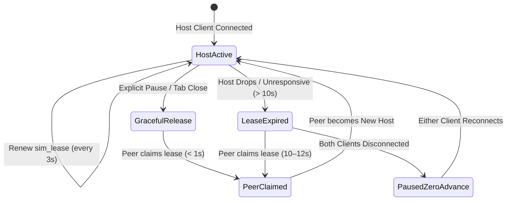

# Bounded Private Family Co-Op Extension Plan

## Executive Summary & Product Objective

The Cats simulator was originally designed as a private single-player browser life simulation (Tasks 01–32). The user has issued an explicit new requirement:
> **"I WANT TO ALSO MAKE IT SO HER AND HER DAUGHTER CAN PLAY TOGETHER"**

This plan specifies a bounded, build-ready extension that enables the mother and daughter to play collaboratively in real time. It introduces **Requirement R26** and **Tasks 33–38**, strictly preserving all 25 confirmed baseline requirements (R01–R25), all 32 existing task definitions, and all fundamental game invariants (8-cat household limit, career clothing, death permanence, private allowlist, and zero unattended offline progression).

---

## 1. Confirmed Decisions & Remaining Working Defaults

Following direct user steering in `FAMILY-GENETICS-DECISIONS-02.md`:
1. **Shared Household**: **CONFIRMED** by user (Option 1). Mother and daughter share the exact same household, 8 cats total, shared cottage, and shared family economy.
2. **Device Setup**: **CONFIRMED** by user. Two simultaneous players, each on her own phone or computer, with independent viewports and simultaneous active input.
3. **Player Cat Allocation**: **CONFIRMED** by user ("they can both have up to 4 cats each"). Hard limit of 4 living/reserved cat slots per player; 8 living/reserved total in household. Dam-primary with partner-overflow reservation; atomic conversion at birth; no silent reassignment, eviction, or deletion.

### Remaining Working Defaults (Designated Engineering Defaults, Not Final User Choices)
1. **Shared Control vs. Segregated Control**:
   - **Working Default**: **Shared Care**. Both players can direct, care for, and nurture all 8 cats; color-coded reticles (Coral for Mom `#FF7A59`, Lavender for Daughter `#A78BFA`) and status indicators distinguish concurrent interactions.
   - *Alternative*: Segregated control where each player can direct only her own 4 assigned cats.
2. **Offspring Inheritance Odds Policy**:
   - **Working Default**: **45% Dam / 45% Sire / 10% Novel Domestic Catalog** (`weighted_novel`).
   - *Alternative*: **50% Dam / 50% Sire** (`strict_parents`).
   - Both policies are parameterized in the unified genetics engine contract without control-flow changes. Source probabilities are renormalized into observable outcome odds when parents share identical traits.


---

## 2. Recommended Production Architecture & Key Tradeoffs

### The Runtime & Platform Reality

Current official documentation for the target deployment platform (Next.js on Vercel with PostgreSQL / Neon):
- **Native WebSocket & Streaming Support**: Vercel Functions natively support WebSockets via standard `WebSocket` and streaming APIs (see [Vercel Functions WebSockets](https://vercel.com/docs/functions/websockets) and [Vercel Guide: Do Vercel Serverless Functions Support WebSocket Connections?](https://vercel.com/kb/guide/do-vercel-serverless-functions-support-websocket-connections)). There is no fictional platform ban on WebSockets.
- **Function Execution Duration & Fluid Compute**: Function durations can be configured up to plan limits (e.g., standard vs Fluid Compute; see [Vercel Function Duration Configuration](https://vercel.com/docs/functions/configuring-functions/duration)), allowing execution durations up to 300 seconds on Pro / Enterprise or 60 seconds on Hobby.
- **Stateless Serverless Concurrency & Ephemeral Containers**: Regardless of connection protocol, Vercel serverless function instances are ephemeral and dynamically scaled. Multiple simultaneous requests or connections from the two devices will land on different physical runtime containers (e.g. Container A holding Mother's open SSE stream while Container B processes Daughter's HTTP POST command). Therefore, **in-memory global state cannot serve as an authoritative message bus, and in-memory broadcast does not work across serverless containers**. Cross-client state synchronization requires querying a durable shared store.

### The Recommended Architecture:
**PostgreSQL-Backed Durable Command Log with Server-Sent Events (SSE) Downstream & HTTP POST Upstream**

```mermaid
sequenceDiagram
    autonumber
    participant Mom as Mom's Device (Host / Peer)
    participant VercelA as Container A (SSE Stream: GET /coop/stream)
    participant DB as PostgreSQL (Neon)
    participant VercelB as Container B (POST /coop/command)
    participant Daughter as Daughter's Device (Peer / Host)

    Note over Mom,Daughter: Both authenticated via private family session
    Daughter->>VercelB: POST /api/households/[id]/coop/command (e.g. Feed Cat)
    Note over VercelB: 1. Authenticate actor & verify membership<br/>2. Lock household state (FOR UPDATE)<br/>3. Resolve idempotent receipt<br/>4. Run canonical dispatch(state, command)<br/>5. Atomically persist state + revision + receipt + coop_commands
    VercelB->>DB: BEGIN TX: Update snapshot, insert receipt, append coop_commands; COMMIT
    VercelB-->>Daughter: 200 OK { commandId, cmd_seq: 104, revision: 43 }
    Note over DB: Serialized sequence committed and durable
    Note over VercelA: SSE Query Loop: SELECT * FROM coop_commands WHERE cmd_seq > $lastSeen
    VercelA->>Mom: SSE Event: command { seq: 104, actor: 'daughter', payload }
    VercelA->>Daughter: SSE Event: command { seq: 104, actor: 'daughter', payload }
    Note over Mom: Host schedules bounded tick: POST /coop/tick
    Mom->>VercelB: POST /api/households/[id]/coop/tick (dt: 1 sim min, leaseEpoch: 3)
    VercelB->>DB: Verify lease; lock; canonical advance(state, 1); commit revision 44
    Note over VercelA: SSE Query Loop detects revision 44 / tick event
    VercelA->>Mom: SSE Event: state_tick { seq: 105, revision: 44, simMinute: 182 }
    VercelA->>Daughter: SSE Event: state_tick { seq: 105, revision: 44, simMinute: 182 }
```

### Architectural Breakdown:

1. **Transport Layer & Ephemeral Container Loop**:
   - **Downstream Broadcast (Server to Client)**: Next.js App Router route handler `GET /api/households/[id]/coop/stream` streaming `text/event-stream` via standard `ReadableStream`.
     - Delivers initial snapshot, active presence, sequenced commands, periodic ticks, and cooperative pause events.
     - **Durable PostgreSQL Query Loop**: The route handler holds an open `ReadableStream` that polls PostgreSQL (`SELECT * FROM coop_commands WHERE household_id = $id AND cmd_seq > $lastSeen ORDER BY cmd_seq ASC LIMIT 50`) on a bounded short interval (250ms–500ms). There is zero in-memory broadcast authority.
     - **Connection Pool Bounds & Request Abort**: Database queries execute using pooled connections with strict connection timeouts and pool concurrency limits. When the client disconnects, `req.signal.onabort` immediately cancels pending queries, terminates the poll loop, and closes the stream with zero leaking connections.
     - Periodic keep-alive comments (`: ping\n\n`) every 15 seconds prevent proxy timeouts within Vercel execution bounds (~55s lifetime with automatic client reconnect).
     - **Cursor Reconnection & Pruning Fallback**: Reconnecting `EventSource` passes `Last-Event-ID: <cmd_seq>`. If `Last-Event-ID` has been compacted in `coop_commands`, server emits `event: snapshot_reload` with the current snapshot revision and stream cursor.
   - **Upstream Commands (Client to Server)**: Standard HTTP `POST /api/households/[id]/coop/command` with JSON payload, client `commandId` (for idempotency), `expectedRevision`, and authenticated session cookie (`cats_session`).

2. **Authority & Server-Side Reducer Execution**:
   - **Canonical Server-Side Dispatch**: The server is the sole state authority. `POST /coop/command` executes `dispatch(currentWorldState, command, actorContext)` server-side within a PostgreSQL transaction holding an exclusive lock on `households`. Client-authored replacement states are rejected. Writes are visible to the SSE stream query loop only after the transaction commits.
   - **Client Timing Leader (Dynamic Simulation Host Lease)**: One connected client holds the active `sim_lease`. The host issues bounded tick requests (`POST /api/households/[id]/coop/tick`) at a fixed cadence (1 real second per sim minute, bounded to max 1 sim minute per request).
   - The server validates the host's `lease_epoch` against `sim_leases`, advances simulation state atomically via canonical `advance(state, dt)` in PostgreSQL, updates the canonical revision, and appends the tick event to `coop_commands`.
   - **Local Optimistic Reducer Execution**: Both clients apply commands locally upon sequence acknowledgment to provide instantaneous visual response, but reconcile against authoritative server revisions.

3. **Caretaker Slot Profiles & Member Revocation Custody**:
   - **Two Stable Caretaker Profiles**: Household cats are partitioned between Profile Alpha (Owner) and Profile Beta (Invitee), each capped at 4 living/reserved cats (8 total in household).
   - **Revocation Safety**: Revoking an invitee terminates their session and SSE stream, but **NEVER deletes their cats or silently reallocates them into the Owner's slots**. The cats remain in Profile Beta; the active Owner cares for them under the working SharedCare default. Rebinding an invitee to Profile Beta re-attaches that player to the existing 4-cat roster without expanding household capacity beyond 8.
   - **Explicit Custody Reassignment**: An explicit `REASSIGN_CAT_CUSTODY` command (`POST /api/households/[id]/cats/[id]/reassign`) enables deliberate custody transfers, verifying both profiles remain within their 4-cat ceiling and atomically moving gestating litters with their parent.

4. **Event Log Compaction vs. Durable Idempotency Receipts**:
   - **Separate Lifecycles**: Ephemeral `coop_commands` are pruned after 15 minutes once committed into snapshots (`created_at < NOW() - INTERVAL '15 minutes' AND cmd_seq <= snapshot_cmd_seq`).
   - **Durable Command Receipts**: Financial transactions, adoptions, recruitments, and births are recorded in `command_receipts` with monotonic per-actor sequences (`actor_seq`). Old/compacted command sequences return explicit `409 Conflict` (`EXPIRED_COMMAND_SEQUENCE`) and are never silently treated as new.

5. **Authority Failover Semantics & Realistic Timing**:
   - **Lease Parameters**: The `sim_leases` record has a 10-second TTL (`expires_at = NOW() + INTERVAL '10 seconds'`). The active host renews the lease every 3 seconds via heartbeat (`POST /api/households/[id]/coop/heartbeat`).
   - **Graceful Handoff**: When a host client explicitly pauses, navigates away, or closes their tab cleanly (`pagehide`/`beforeunload`), the client sends `POST /api/households/[id]/coop/lease/release`. The lease is immediately marked expired (`expires_at = NOW()`), and the peer acquires the lease via `POST /api/households/[id]/coop/lease/claim` in **< 1 second**.
   - **Abrupt Disconnect / Crash**: If the host device suddenly crashes, runs out of battery, or loses network connectivity:
     - The 10-second lease expires after 10 seconds.
     - The peer watchdog loop detects the expired lease after the 10-second window plus its next poll interval.
     - The peer calls `POST /api/households/[id]/coop/lease/claim` via atomic CAS, increments `lease_epoch`, and becomes the new simulation host.
     - **Realistic Maximum Failover Wait**: **10 to 12 seconds**. During this failover window, simulation advancement stops and the UI displays an honest, reassuring status pill: *"Reconnecting family host..."*. No progress is lost, and simulation resumes from the last committed server revision.

6. **Zero Unattended Offline Progression (R09)**:
   - When both players are disconnected or have closed their browsers, **no client holds an active lease and no tick commands are submitted**.
   - The server executes 0 ticks; exactly 0 sim minutes advance.
   - When players return 3 hours or 3 days later, the household state is restored from the last committed PostgreSQL snapshot.
   - There is no wall-clock catch-up, no offline decay, no unattended death, and no missed career shifts.

7. **Key Tradeoffs**:
   - **Tradeoff**: Choosing PostgreSQL-backed command sequencing with SSE over an external stateful WebSocket daemon eliminates external vendor lock-in, infrastructure cost, and complex WebSocket server operations. It introduces a bounded 10–12 second pause during unexpected host drops, which is explicitly communicated to the user with truthful UI status.

---

## 3. Scope Delta: Assumptions Changed vs. Preserved

### Exact Single-Player Assumptions That Legally Change:
1. **Single Owner Exclusivity on Household Access**:
   - *Was*: Only 1 user account could view or mutate household state.
   - *Now*: Household supports multiple authorized members (`household_members`) with roles: `owner` (Mom) and `family_member` (Daughter). Both can view, care for cats, build, decorate, shop, and earn money.
   - *Preserved Constraint*: The unique constraint on `households.owner_id` is **STRICTLY PRESERVED**. Task 01 owner-create concurrency safety is maintained. Multi-member co-op is handled through `household_members`.
2. **Exclusive Writer Lockout** (`leases` table returning 409):
   - *Was*: A 2nd active device caused a lease conflict (409) or required forced takeover, treating the 2nd device as an intruder.
   - *Now*: Multiple active sessions connect simultaneously. The exclusive single-writer lease is replaced with multi-actor presence + a dynamic background `sim_lease` for the timing leader.
3. **Single Player Camera / Selected Cat**:
   - *Was*: Global single `selectedCatId` in `GameView`.
   - *Now*: Multi-actor selection: `selectedCatByActor: Record<string, string>`. Distinct pastel reticles display both players' focus points simultaneously.
4. **Single-Player Pause**:
   - *Was*: Unilateral pause/resume toggle on local client.
   - *Now*: Cooperative pause semantics: **either** player can pause instantly (child-safe and parent-friendly). Clear UI banner indicates who paused.

### Exact Game Invariants Strictly Preserved:
1. **8-Cat Household Limit (R20, R21)**: Maximum 8 living cats (`livingCount + sum(reservedLitterSlots) <= 8`). Concurrency never overflows capacity.
2. **Career Clothing (R14)**: Work clothes equip automatically at departure, restore on return, persist across reloads, and render identically on both screens.
3. **Permanence & Death (R08, R22)**: Death is permanent. Memorials are immutable. Ghosts are non-resurrecting projections.
4. **No Offline Progression (R09)**: Zero needs decay, zero aging, and zero action advancement while closed or unattended.
5. **Private Gift Privacy (R11)**: Strict private allowlist. No public registration, no public player directory, no stranger discovery. Daughter included as authorized private family member.
6. **Moo-Moo Mutual Readiness (R16, R17, R18, R19)**: Friendship >= 70, mutual love, alignment, willingness, mood >= 60. Declines emit event and consume 0 RNG rolls.
7. **Free-Build Provenance (R13)**: Free-build edits retain provenance; cannot mint progression money or resale value.

---

## 4. Private Family Enrollment & Actor Isolation

### Enrollment & Secret Capability Invitation Protocol:

1. **Invite Generation**:
   - Primary owner navigates to *Settings -> Family Play -> Create Invite Link*.
   - Route `POST /api/households/[id]/invites` generates a 256-bit high-entropy secret token.
   - The token is hashed at rest (`token_hash = sha256(token)`) in `household_invites` with a 72-hour TTL and single-use constraint (`max_uses = 1`).
   - The full secret URL `https://[domain]/join/[token]` is displayed in the UI with a "Copy Link" button.
   - **Strict Privacy & Anti-Spam Rule**: The link is **never** emailed, sent via SMS, or exposed to third parties. It is shared strictly out-of-band by the parent (e.g. AirDrop, Messages, local copy). No external invitations are sent under Russell's name.

2. **Invite Redemption**:
   - Daughter opens the link on her iPad or phone.
   - The UI displays an enrollment card and sends `POST /api/invites/redeem` with `{ token, displayName, colorTheme }` in the request body (never in URL query parameters or referrers).
   - **Child Safety (Zero PII Collection)**: No date of birth, age, school, phone number, real name, or email address is collected. Daughter enters only a friendly display name (e.g., "Daughter" or chosen nickname) and selects an avatar color (e.g., Lavender).
   - Route validates the token hash against unexpired, non-revoked invites in an atomic database transaction.
   - An authenticated session cookie (`cats_session`) is issued, and an entry is written to `household_members`.
   - Subsequent visits use the session cookie directly; the daughter **never needs to re-enter or re-paste the invite link**.

3. **Revocation & Access Boundary**:
   - Primary owner can view connected family members in Settings and click "Revoke Access" at any time.
   - Route `POST /api/households/[id]/members/[memberId]/revoke` marks the membership revoked, invalidates active sessions, and terminates SSE streams immediately.
   - Daughter has full gameplay parity (feeding, building, grooming, romance, goals, café) but cannot delete the household or evict the owner.

---

## 5. Synchronized Authoritative Simulation & Command Protocol

### Command Flow:

1. **Optimistic Local Preview**:
   - When a player directs a cat or places furniture, the local client renders an immediate visual preview (e.g., dashed path or placement ghost).
2. **Sequenced Submission**:
   - Client issues `POST /api/households/[id]/coop/command` with `{ commandId, expectedRevision, command }`.
   - Next.js server validates member authorization, idempotency, and appends the command to `coop_commands` in PostgreSQL, generating a strictly monotonic `cmd_seq` BIGSERIAL.
3. **SSE Broadcast & Reconnection Replay**:
   - The command is broadcast immediately to all connected clients listening on `GET /api/households/[id]/coop/stream`.
   - If a client disconnects, its reconnecting `EventSource` passes `Last-Event-ID: <cmd_seq>`, and the server replays any missed commands from PostgreSQL.
4. **Deterministic Dispatch**:
   - Both clients receive the sequenced command and execute `dispatch(state, command, context)`.
   - Because `dispatch` is a pure function operating on identical seeds and sequence numbers, both clients arrive at the exact same state.
5. **Periodic Authoritative Cloud Snapshots**:
   - The active host client commits periodic snapshots (`SaveEnvelope`) via CAS `POST /api/households/[id]/save` every 60 sim seconds or upon major lifecycle events (conception, birth, adoption, death).

---

## 6. Concurrency & Conflict Resolution Engine

| Surface | Race Condition Scenario | Resolution Rule | User Feedback / UI Behavior |
|---|---|---|---|
| **Cat Direct Care** | Mom commands Mochi to "Groom"; Daughter commands Mochi to "Feed" at the exact same second. | **First Sequenced Claims**: Command with earlier `cmd_seq` claims Mochi's active action queue. Second command evaluates Mochi's busy state. Cat selection is visual-only and non-exclusive. | If compatible, appended to queue. If physically conflicting (e.g. being held), second player receives a friendly toast: *"Mochi is currently busy with Mom"*. Neither player is locked out. |
| **Furniture Placement** | Both players attempt to place furniture on the same grid cell simultaneously. | **Grid Cell CAS**: First placed item commits cell occupancy. Second placement fails cell validation. | Placed object stays; second item returns to catalog; second player's wallet is not deducted; toast shows *"Cell occupied"*. |
| **Demolition & Moving** | Mom tries to move a scratching post while Daughter tries to recolor or delete it. | **Object ID CAS**: Command targets stable `objectId`. If object is modified or deleted by earlier sequence, subsequent action aborts cleanly. | Toast: *"Object was moved by Mom"*. Action reverts cleanly without desync. |
| **Economy & Spending** | Household has $100. Mom buys a cat tree for $70; Daughter buys a cushion for $60 simultaneously. | **Atomic Wallet Balance Check**: Server transaction validates current balance. Mom's command executes ($100 - $70 = $30). Daughter's command evaluates against remaining $30 and fails. | Daughter receives clear toast: *"Not enough household funds ($30 remaining)"*. Wallet never drops below zero. |
| **Moo-Moo Romance & Capacity** | Household has 7 cats (1 slot left). Two pairs of cats complete Moo-Moo simultaneously. | **Strict 8-Cat Invariant Clamp**: Pair 1 executes conception roll (25% chance). If successful, reserves slot 8 (`reservedLitterSlots = 1`). Pair 2 executes: available capacity is `8 - 7 - 1 = 0`. Romance completes without a conception roll (R21). | Both romantic interactions succeed emotionally; only Pair 1 conceives; zero chance of overflowing 8-cat limit. |
| **Household Goals (18 Goals)** | Both players collaborate to complete goals (e.g. catch 10 mice, plant 5 strawberries). | **Shared Canonical Events**: Goals evaluate real committed domain events from the shared simulation stream, not client-local manual counters. | Both players see goal progress update in real time. Unlocks and reward coins are credited to the shared household account atomically. |

---

## 7. Multi-Actor Presence, UI & Shared Pause Semantics

1. **Player Reticles**:
   - Mom's selection: Semi-transparent **Coral ring** (`#FF7A59`) pulsing gently around her selected cat.
   - Daughter's selection: Semi-transparent **Lavender ring** (`#A78BFA`) pulsing gently around her selected cat.
   - Selection is non-exclusive: both players can inspect the same cat at the same time without locking each other out.
2. **HUD Presence Indicators**:
   - Compact status pill in top right showing:
     - `[• Mom (Host)]` (Green active dot)
     - `[• Daughter]` (Green active dot / Yellow away dot)
   - Tapping partner's avatar smoothly pans the viewport to their selected cat.
3. **Instant Cooperative Pause (Safety First)**:
   - Either player can tap the Pause button at any time.
   - Simulation stops immediately on both devices (0 sim minutes advance).
   - Prominent HUD banner appears: *"Paused by Daughter"* or *"Paused by Mom"*.
   - Either player can tap "Resume". When tapped, simulation unpauses and returns to standard fixed-step advance.

---

## 8. Authority Failover & Zero-Advance Rejoin Lifecycle



1. **Host Departure / Failover**:
   - **Graceful**: Active host closes tab or pauses; issues `POST /api/households/[id]/coop/lease/release`. Surviving peer assumes host role in < 1 second.
   - **Abrupt**: Host loses battery, Wi-Fi, or crashes. Lease TTL is 10 seconds. Surviving peer claims lease after expiration (~10–12s realistic maximum failover wait). Simulation resumes from the last committed server revision.
2. **Both Players Disconnect**:
   - When 0 active sessions remain, `sim_leases` expires.
   - No client runs ticks; no server process exists.
   - Database remains completely static.
   - When players return 3 hours or 3 days later, `simMinute` is identical to the exact second they left.
   - **Zero offline progression invariant (R09) is completely satisfied.**

---

## 9. Formal Requirement R26 Definition

```json
{
  "id": "R26",
  "title": "Private family co-op",
  "decision": "She and her daughter can play together simultaneously from their own devices in one shared household with up to four cats per player (eight household total). Preserve private family access, mutual presence, cooperative pause, all existing gameplay and no unattended offline progression."
}
```

**Scope & Invariants**:
1. Private family enrollment via single-use, cryptographically secure invitation links generated by the owner; no child date of birth, age, or personal tracking information shall be collected.
2. Real-time command synchronization and state broadcast over serverless-native HTTP streaming; authoritative conflict resolution for simultaneous cat interaction, building edits, economy transactions, and romance.
3. Visual multi-actor presence with distinct pastel selection reticles (Coral / Lavender) and HUD presence indicators.
4. Instant cooperative pause accessible to either player, with zero simulation advancement, needs decay, or aging occurring while paused or when both players are away.
5. Absolute preservation of all confirmed game rules: 4 cats per player / 8 total living capacity, caretaker slot profile custody, career clothing, death permanence, memorials, non-resurrecting ghosts, and private gift security.

---

## 10. Additive Task Matrix (Tasks 33–38)

| Task | Slug | Title | Needs | Deliverable |
|---|---|---|---|---|
| **33** | `family-membership-invites` | Private family membership, invite links, and multi-actor access control | 1, 3 | Owner generates private invite links; daughter joins without child PII; preserves `households.owner_id UNIQUE`; multi-member access control on all routes. |
| **34** | `coop-sse-transport-sequencing` | Real-time SSE transport, command sequencing, and authoritative host lease | 3, 33 | Next.js SSE stream route with durable Postgres poll loop (no in-memory broadcast), monotonic PostgreSQL command sequencing (`coop_commands`), 10s simulation host lease with 3s heartbeats. |
| **35** | `multiactor-presence-shared-pause` | Multi-actor world presence, selection reticles, and shared pause semantics | 2, 34 | Coral and Lavender reticles on Pixi canvas; HUD presence avatars; instant cooperative pause and zero-advance pause banner. |
| **36** | `concurrent-actions-conflict-resolution` | Concurrent economy, building, and Moo-Moo conflict resolution | 7, 8, 10, 19, 35 | Server-side canonical dispatch inside Postgres transaction; caretaker slot profile custody; race-condition resolvers for cat care, grid cell building collision, wallet deduction, and 8-cat capacity clamping under dual Moo-Moo. Shared canonical goal events. |
| **37** | `host-failover-reconnect-recovery` | Shared-room host failover, offline zero-advance, and two-device reconnection recovery | 34, 35, 29 | 10-second host lease failover (10–12s max failover wait); command log compaction (15m) separated from durable command receipts; snapshot reload on compacted `Last-Event-ID`; strict zero offline advance when unattended. |
| **38** | `e2e-coop-verification-gauntlet` | End-to-end mother-daughter co-op verification on physical desktop and phone | 28, 31, 35, 36, 37 | Full dual-device physical dogfooding (desktop mouse + phone touch) passing all 5 Co-Op Gauntlet Gates with zero regressions. |

---

## 11. Confirmed Decisions & Working Defaults Log

### Confirmed User Authority (2026-09-20)
1. **Shared Household**: CONFIRMED (Option 1). Mother and daughter share one single household, cottage, and economy.
2. **Two Simultaneous Devices**: CONFIRMED. Simultaneous play from separate devices (desktop/laptop pointer + phone/tablet touch).
3. **Player Capacity Clamping (4 Cats Each / 8 Total)**: CONFIRMED. Hard 4-slot ceiling per caretaker profile, 8 living/reserved total in household.

### Designated Engineering Defaults
1. **Shared Control vs. Segregated Control**:
   - **Working Default**: **Shared Care**. Both players can direct and care for all cats, with visible player reticles and partner indicators.
   - *Alternative Policy*: Segregated control where each player can direct only her own 4 assigned cats.
2. **Child Display Preference**: Default display name "Daughter" with Lavender theme; custom nickname entry supported.
3. **Simultaneous Free-Build**: Entering free-build mode displays mutual confirmation banner to avoid interrupting earned-mode play.
4. **Moo-Moo Notification**: Cute celebratory heart particle burst over the participating cats.

---

## 12. Artifact File Index

All deliverables for the Private Family Co-Op planning mission are bounded strictly within `work/orchestrator/coop-plan/**` and related planning mirrors:
- [PLAN.md](file:///Users/russell/.codex/worktrees/cats-foundation/Cats/work/orchestrator/coop-plan/PLAN.md) — Master bounded extension plan (this file).
- [DECISION-MATRIX.md](file:///Users/russell/.codex/worktrees/cats-foundation/Cats/work/orchestrator/coop-plan/DECISION-MATRIX.md) — Architectural decision, capability, invariant, and pending choice delta matrix.
- [CONTRACTS.md](file:///Users/russell/.codex/worktrees/cats-foundation/Cats/work/orchestrator/coop-plan/CONTRACTS.md) — Database DDL migrations, REST/SSE API endpoints, TypeScript domain models, and conflict resolution rules.
- [TASKS.md](file:///Users/russell/.codex/worktrees/cats-foundation/Cats/work/orchestrator/coop-plan/TASKS.md) — Full specification of additive Tasks 33–38 with dependencies, acceptance criteria, and verification suites.
- [GAUNTLET-ADDENDUM.md](file:///Users/russell/.codex/worktrees/cats-foundation/Cats/work/orchestrator/coop-plan/GAUNTLET-ADDENDUM.md) — Additive Gauntlet verification gates (Gates 11–15) and physical device testing protocol.
- [COOP-ADDENDUM.md](file:///Users/russell/.codex/worktrees/cats-foundation/Cats/.gauntlet/bar/COOP-ADDENDUM.md) — Gauntlet bar mirror preserving base `BAR.md` byte-for-byte.
- [PROGRESS.md](file:///Users/russell/.codex/worktrees/cats-foundation/Cats/work/orchestrator/coop-plan/PROGRESS.md) — Planning progress and verification evidence.
